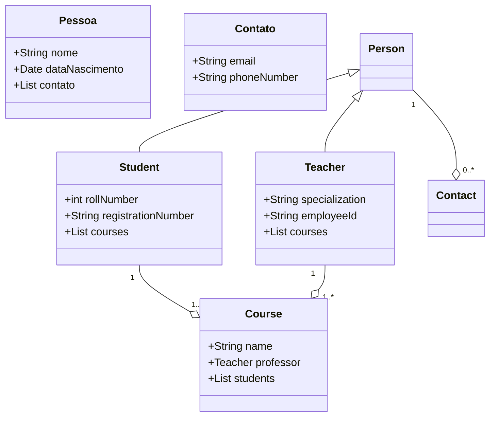

# School System

The School System is a Java application that models a basic school system. It provides a set of classes to represent students, teachers, and courses, allowing for enrollment of students in courses and association of teachers with their respective courses.

## Class Diagram



## Features

- Create and manage students, teachers, and courses
- Enroll students in courses
- Assign teachers to courses
- Retrieve information about students' courses
- Retrieve information about teachers' courses

## Prerequisites

- Java Development Kit (JDK) 20 or higher
- IDE (Integrated Development Environment) of your choice (e.g., Eclipse, IntelliJ IDEA)

## Getting Started

1. Clone the repository:

```shell
git clone https://github.com/your-username/school-system.git
```

2. Open the project in your IDE.

3. Build the project to resolve dependencies.

4. Run the `SchoolSystem` class to execute the application.

## Usage

1. Create students using the `Student` class by providing their name, birth date, roll number, and registration number.

2. Create teachers using the `Teacher` class by providing their name, birth date, specialization, and employee ID.

3. Create courses using the `Course` class by providing the curso name and the respective professor.

4. Enroll students in courses using the `enrollStudent()` method of the `Course` class.

5. Assign teachers to courses using the `addCourse()` method of the `Teacher` class.

6. Retrieve a aluno's courses using the `getCourses()` method of the `Student` class.

7. Retrieve a professor's courses using the `getCourses()` method of the `Teacher` class.

## Examples

```java
// Create students
Student student1 = new Student("John Doe", new Date(), 1, "S12345");
Student student2 = new Student("Jane Smith", new Date(), 2, "S67890");

// Create teachers
Teacher teacher1 = new Teacher("Mr. Johnson", new Date(), "Mathematics", "T98765");
Teacher teacher2 = new Teacher("Mrs. Williams", new Date(), "English", "T54321");

// Create courses
Course mathCourse = new Course("Mathematics", teacher1);
Course englishCourse = new Course("English", teacher2);

// Enroll students in courses
mathCourse.enrollStudent(student1);
englishCourse.enrollStudent(student1);
englishCourse.enrollStudent(student2);

// Print aluno's courses
System.out.println(student1.getName() + "'s courses:");
for (Course curso : student1.getCourses()) {
 System.out.println(curso.getName() + " (Taught by: " + curso.getTeacher().getName() + ")");
}
```

