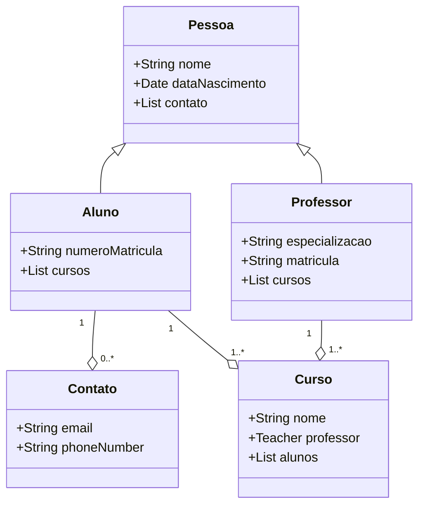

# Sistema escolar

O Sistema Escolar é um aplicativo Java que modela um sistema escolar básico. Disponibiliza um conjunto de turmas para representar alunos, professores e cursos, permitindo a matrícula de alunos em cursos e associação de professores com seus respectivos cursos.

## Diagrama de classe



## Features

- Criar e gerenciar alunos, professores e cursos
- Inscrever alunos em cursos
- Atribuir professores a cursos
- Recuperar informações sobre os cursos dos alunos
- Recuperar informações sobre os cursos dos professores

## Pré-requisitos

- Kit de Desenvolvimento Java (JDK) 20 ou superior
- IDE (Integrated Development Environment) de sua escolha (por exemplo, Eclipse, IntelliJ IDEA)

## Começando

1. Clone o repositório:

```shell
git clone https://github.com/your-username/school-system.git
```

